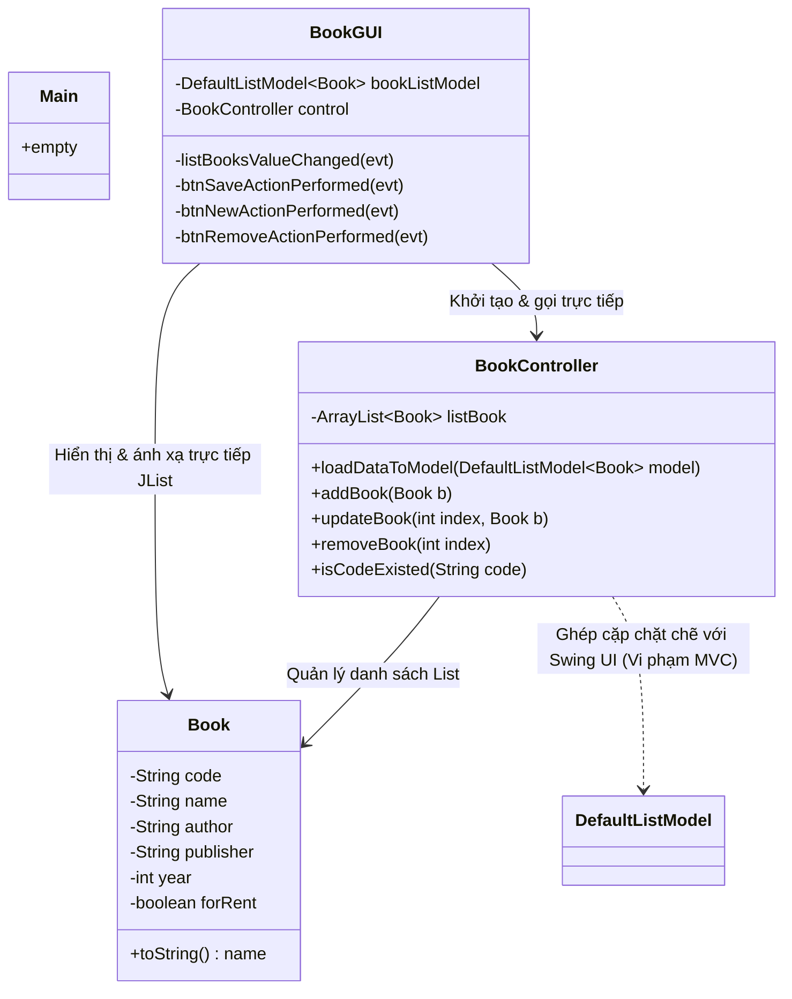

# Báo Cáo Phân Tích Kiến Trúc Hệ Thống: Dự án "Manage Book"

Báo cáo này tập trung phân tích cấu trúc mã nguồn hiện tại của dự án **Manage Book** viết bằng Java Desktop Swing. Mục tiêu là đối chiếu kiến trúc hiện tại với chuẩn mô hình **MVC (Model - View - Controller)**, chỉ ra các điểm vi phạm thiết kế, ghép cặp (coupling) không tốt, các đoạn code sai Layer hoặc quá tải trách nhiệm (Single Responsibility Principle violation), từ đó đưa ra danh sách các vấn đề được sắp xếp theo mức độ ưu tiên từ nghiêm trọng đến ít nghiêm trọng nhất.

---

## 1. Sơ đồ Kiến trúc & Luồng dữ liệu

Dưới đây là so sánh trực quan giữa **Kiến trúc hiện tại (Bị lỗi thiết kế)** và **Kiến trúc MVC Chuẩn (Đề xuất)**.

### A. Kiến trúc Hiện tại (Bị lỗi thiết kế & Ghép cặp chặt)

Trong kiến trúc này, **View (`BookGUI`)** và **Controller (`BookController`)** phụ thuộc lẫn nhau một cách trực tiếp. Controller nắm giữ trạng thái dữ liệu (đáng lẽ thuộc về Model) và thao tác trực tiếp lên thành phần giao diện của Swing (`DefaultListModel`).



### B. Kiến trúc MVC Chuẩn (Đề xuất)

Trong kiến trúc chuẩn, **View** hoàn toàn độc lập với **Model** về mặt logic nghiệp vụ. **Controller** đóng vai trò điều phối hành động từ View sang Model. Model giữ vai trò quản lý dữ liệu nghiệp vụ và thông báo cho View cập nhật thông qua cơ chế **Observer Pattern (hoặc Event Listeners)** để tránh phụ thuộc ngược.

```mermaid
classDiagram
    direction TB
    class Main {
        +main(args) : Khởi tạo & Ráp nối hệ thống
    }
    class BookModel {
        -String code
        -String name
        ...
    }
    class BookRepository / BookManager {
        -ArrayList~BookModel~ books
        -List~BookModelListener~ listeners
        +addBook(Book b)
        +updateBook(int index, Book b)
        +removeBook(int index)
        +isCodeExisted(String code)
        +addModelListener(BookModelListener l)
    }
    class BookController {
        -BookRepository model
        -BookGUI view
        +handleSaveBook(String code, String name, String author, String publisher, String year, boolean forRent, int selectedIndex)
        +handleDeleteBook(int selectedIndex)
        +handleNewBookForm()
    }
    class BookGUI {
        +updateBookList(List~BookModel~ books)
        +getSelectedBookIndex()
        +displayBookDetails(BookModel b)
        +showErrorMessage(String msg)
        +showSuccessMessage(String msg)
    }

    Main --> BookRepository : Khởi tạo Model
    Main --> BookGUI : Khởi tạo View
    Main --> BookController : Khởi tạo Controller & Tiêm (Inject) Model, View
    BookController --> BookRepository : Thay đổi dữ liệu/Gọi Logic nghiệp vụ
    BookController --> BookGUI : Điều khiển hiển thị giao diện
    BookRepository ..> BookGUI : Thông báo thay đổi dữ liệu (Observer Pattern)
```

---

## 2. Kiểm tra chi tiết các lớp hiện tại theo yêu cầu

### A. View (`BookGUI`) có đang chứa quá nhiều business logic không?
> [!IMPORTANT]  
> **CÓ.** Lớp `BookGUI` hiện tại đang đảm nhận quá nhiều vai trò ngoài chức năng hiển thị giao diện thông thường.

*   **Tự khởi tạo dữ liệu mẫu (Data Seeding) trong View:** 
    ```java
    bookListModel.addElement(new Book("DBI202", "Core Java 01", "Author A", "Publisher X", 2016, true));
    bookListModel.addElement(new Book("PRO192", "C#. Net", "Author B", "Publisher Y", 2017, false));
    ```
    Việc khởi tạo dữ liệu mẫu này thuộc về tầng dữ liệu hoặc tầng nghiệp vụ (Controller/Model), không được hardcode trực tiếp trong hàm khởi tạo của View.
*   **Chứa logic kiểm tra và điều hướng nghiệp vụ (Flow Coordination):**
    Trong phương thức `btnSaveActionPerformed`:
    *   View tự kiểm tra index được chọn (`listBooks.getSelectedIndex()`) để quyết định gọi `control.updateBook(index, b)` hay `control.addBook(b)`.
    *   Tự xử lý việc kiểm tra trùng mã: `control.isCodeExisted(code)`.
    *   Tự xử lý logic đồng bộ hóa: Sau khi lưu dữ liệu, View phải thủ công gọi `control.loadDataToModel(bookListModel)` để cập nhật dữ liệu hiển thị.
*   **Logic Validate dữ liệu nghiệp vụ:**
    ```java
    if (code.isEmpty() || name.isEmpty() || author.isEmpty() || publisher.isEmpty()) {
        javax.swing.JOptionPane.showMessageDialog(this, "Tất cả các trường không được để trống!");
        return;
    }
    ```
    Mặc dù việc validate rỗng giao diện cơ bản có thể nằm ở View, nhưng việc gộp chung cả validate định dạng dữ liệu (như parse năm sản xuất, kiểm tra trùng lặp) trực tiếp trong Listener làm View bị phình to và khó viết Unit Test độc lập.

### B. Controller (`BookController`) đã đúng vai trò chưa?
> [!WARNING]  
> **CHƯA.** `BookController` hiện tại đang làm sai nhiệm vụ của một Controller chuẩn.

*   **Đang kiêm nhiệm vai trò của Model (State Storage):**
    Controller nắm giữ danh sách dữ liệu `private ArrayList<Book> listBook`. Theo mô hình MVC, dữ liệu hoặc tập hợp dữ liệu là thuộc về **Model**. Controller chỉ nắm giữ tham chiếu đến Model để xử lý nghiệp vụ chứ không trực tiếp chứa dữ liệu gốc.
*   **Ghép cặp chặt (Tight Coupling) với thư viện đồ họa Swing:**
    ```java
    public void loadDataToModel(DefaultListModel<Book> model) {
        model.clear();
        for (Book b : listBook) {
            model.addElement(b);
        }
    }
    ```
    Phương thức này import và nhận tham số trực tiếp là `DefaultListModel<Book>` - một thành phần đồ họa của Swing (`javax.swing.DefaultListModel`). Điều này làm cho Controller bị trói buộc hoàn toàn vào Java Swing. Nếu muốn chuyển dự án này sang JavaFX, Console, hoặc Web, toàn bộ Controller này sẽ bị vỡ và không thể tái sử dụng.

### C. Model (`Book`) có đúng chuẩn MVC chưa?
> [!NOTE]  
> **Gần đúng chuẩn, nhưng có điểm chưa tốt về hiển thị (UI Leakage).**

*   **Lớp `Book` là một POJO sạch:** Nó chứa các thuộc tính, hàm tạo, getters/setters tiêu chuẩn. Điều này rất tốt.
*   **Vi phạm phân tách tầng trong `toString()`:**
    ```java
    @Override
    public String toString() {
        return name;    // Để khi hiện lên JList nó sẽ hiện tên sách
    }
    ```
    Việc ghi đè `toString()` để phục vụ mục đích hiển thị trên `JList` của Swing là một lỗi thiết kế ("rò rỉ" mối quan tâm giao diện vào Model). Nếu sau này một phần khác của hệ thống cần dùng `toString()` để ghi log hoặc debug (cần hiện đầy đủ mã, tên, tác giả...), việc ghi đè này sẽ gây mâu thuẫn. Đúng chuẩn MVC là phải tạo một lớp `ListCellRenderer` trong View để định dạng cách hiển thị phần tử trong JList.
*   **Thiếu lớp Model quản lý danh sách (Collection Model):** Dự án thiếu một Model đại diện cho danh sách các cuốn sách (ví dụ: `BookTableModel` hoặc `BookListModel` phát triển độc lập với Swing) để quản lý việc thông báo sự thay đổi dữ liệu.

### D. Có đoạn code nào đang sai layer không?
*   **Khởi tạo dữ liệu:** Đang nằm ở `BookGUI` (View) thay vì Controller hay cơ sở dữ liệu.
*   **Lưu trữ dữ liệu (`ArrayList<Book>`)**: Nằm ở `BookController` (Controller) thay vì Model.
*   **Logic nghiệp vụ kiểm tra trùng mã sách:** Nằm trong sự kiện click nút Save của `BookGUI` (View).
*   **Cập nhật cấu trúc hiển thị giao diện:** `BookController` trực tiếp thực hiện xóa và add phần tử vào `DefaultListModel` của Swing. Việc này đáng lẽ thuộc nhiệm vụ hiển thị của View hoặc cơ chế tự động đồng bộ (Binding/Observer).
*   **Hành vi thoát hệ thống:** Nút `btnExit` trong View gọi trực tiếp `System.exit(0)`. Trong hệ thống chuyên nghiệp, Controller nên xử lý việc tắt chương trình để đảm bảo các tài nguyên được giải phóng hoặc lưu trữ lại trạng thái trước khi thoát.

### E. Có coupling nào chưa tốt không?
1.  **View trực tiếp khởi tạo Controller:** `BookGUI` tự khai báo `BookController control = new BookController();`. Điều này làm View phụ thuộc cứng vào triển khai cụ thể của Controller, không thể áp dụng Dependency Injection hoặc Mock Test.
2.  **Controller phụ thuộc trực tiếp vào Swing UI:** `BookController` sử dụng `DefaultListModel`.
3.  **Lớp `Main` bị bỏ trống hoàn toàn:** Lớp `Main.java` không thực hiện bất kỳ chức năng nào. Đúng ra, `Main` phải là nơi khởi tạo Model, View, Controller và tiêm (inject) các phụ thuộc này vào nhau để khởi động chương trình (Bootstrap Layer).

### F. Có method nào quá dài hoặc quá nhiều trách nhiệm không?
> [!CAUTION]  
> **Phương thức `BookGUI.btnSaveActionPerformed` quá dài và vi phạm nghiêm trọng Nguyên lý đơn trách nhiệm (Single Responsibility Principle - SRP).**

*   **Các trách nhiệm mà phương thức này đang đảm nhận:**
    1.  Lấy dữ liệu thô từ các JTextField (`getText().trim()`).
    2.  Validate tính hợp lệ cơ bản (Kiểm tra rỗng).
    3.  Chuyển đổi kiểu dữ liệu (Parse String của năm xuất bản sang `int`).
    4.  Khởi tạo đối tượng `Book` mới.
    5.  Xác định chế độ làm việc: Thêm mới (Add) hay Cập nhật (Update) dựa trên chỉ số index của danh sách.
    6.  Thực hiện kiểm tra nghiệp vụ trùng mã sách bằng cách gọi `control.isCodeExisted`.
    7.  Gọi Controller để thay đổi dữ liệu (`control.addBook` hoặc `control.updateBook`).
    8.  Thủ công yêu cầu Controller làm mới danh sách JList (`control.loadDataToModel`).
    9.  Hiển thị thông báo thành công hoặc lỗi thông qua `JOptionPane`.
    10. Bắt ngoại lệ chung `try-catch` và thông báo lỗi.

---

## 3. Danh sách các vấn đề theo mức độ ưu tiên (Prioritized Issues)

| Độ ưu tiên | Vấn đề / Lỗi kiến trúc | Chi tiết lỗi & Ảnh hưởng | Giải thích dưới góc nhìn MVC |
| :--- | :--- | :--- | :--- |
| **1. CRITICAL** | **Lỗi logic gây Crash ứng dụng (`NullPointerException`)** | Lớp `BookController` khai báo `private ArrayList<Book> listBook;` nhưng **không bao giờ được khởi tạo** trong Constructor mặc định `public BookController()`. Khi `BookGUI` gọi `new BookController()` và thực hiện Thêm mới/Cập nhật, ứng dụng sẽ lập tức crash do lỗi NullPointer ở dòng `listBook.add(b)` hoặc `listBook.size()`. | **Lỗi cơ bản trong lập trình:** Không khởi tạo vùng nhớ cho Model dẫn đến sập ứng dụng khi gọi các thao tác nghiệp vụ. |
| **2. HIGH** | **Controller bị ghép cặp chặt chẽ với Swing UI** | `BookController` trực tiếp import và thao tác trên `javax.swing.DefaultListModel`. | **Vi phạm nguyên tắc độc lập của Controller:** Controller đáng lẽ chỉ điều hướng dữ liệu. Việc thao tác trực tiếp lên component UI của Swing làm mất khả năng tái sử dụng Controller trên các nền tảng UI khác. |
| **3. HIGH** | **Tách lớp dữ liệu sai vị trí (Model nằm trong Controller)** | `ArrayList<Book> listBook` đang được lưu trực tiếp trong `BookController`. | **Vi phạm cấu trúc Model:** Dữ liệu ứng dụng và trạng thái danh sách sách phải thuộc lớp Model. Controller không được chứa trạng thái dữ liệu (Stateful), nó nên là một Stateless coordinator. |
| **4. MEDIUM** | **View ôm đồm quá nhiều Logic nghiệp vụ & Điều hướng** | Sự kiện `btnSaveActionPerformed` kiêm nhiệm validate nghiệp vụ, ép kiểu, phân loại hành vi (Add/Update), kiểm tra trùng mã và hiển thị thông báo. | **Vi phạm nguyên tắc View thụ động (Passive View):** View chỉ nên thu thập dữ liệu thô từ người dùng, chuyển dữ liệu đó cho Controller xử lý và hiển thị kết quả. View không được tự quyết định logic lưu/sửa hay validate nghiệp vụ. |
| **5. MEDIUM** | **Lớp `Main` bị bỏ trống, không có Dependency Injection** | Lớp `Main.java` rỗng. Việc khởi tạo được thực hiện cục bộ bên trong các lớp (`BookGUI` tự tạo `BookController`, tự cài đặt LookAndFeel và hiển thị chính nó trong phương thức `main` của GUI). | **Thiếu tầng ghép nối (Bootstrap Layer):** Gây khó khăn cho việc quản lý mã nguồn, mở rộng cơ sở dữ liệu (DAO/Repository) sau này và không thể viết unit test riêng lẻ. |
| **6. LOW** | **Rò rỉ hiển thị (UI Leakage) trong Model `Book`** | Ghi đè `toString()` của lớp `Book` để trả về thuộc tính `name` chỉ để phục vụ hiển thị trên `JList`. | **Vi phạm tính trừu tượng của Model:** Model không được tự định dạng hiển thị cho chính nó dựa trên yêu cầu của một component View cụ thể. |
| **7. LOW** | **Các lớp tiện ích rỗng không được sử dụng** | Lớp `ValidationUtils.java` hoàn toàn rỗng và không được tận dụng cho việc validate dữ liệu. | **Mã nguồn rác/dư thừa:** Làm tăng độ phức tạp của thư mục dự án không cần thiết. |

---

## 4. Hướng khắc phục đề xuất (Khi được phép sửa code)

Dựa trên phân tích trên, khi có yêu cầu tái cấu trúc, chúng ta nên thực hiện theo các bước sau:

1.  **Sửa lỗi Critical:** Khởi tạo `listBook = new ArrayList<>();` trong Constructor mặc định của `BookController` để hệ thống không bị crash.
2.  **Tách Model Quản lý Dữ liệu:** Chuyển danh sách `ArrayList<Book>` từ `BookController` sang một lớp Model quản lý danh sách riêng biệt (ví dụ: `BookRepository` hoặc `BookListModel`).
3.  **Tách biệt UI khỏi Controller:** Loại bỏ hoàn toàn các import liên quan đến `javax.swing` khỏi `BookController`. Trả lại việc cập nhật `DefaultListModel` cho View tự xử lý hoặc sử dụng cơ chế lắng nghe sự kiện (Observer Pattern).
4.  **Tái cấu trúc View:** Thu gọn phương thức `btnSaveActionPerformed`. Chuyển toàn bộ logic quyết định (Save/Update), kiểm tra trùng mã, và ép kiểu sang Controller xử lý. View chỉ truyền dữ liệu thô và nhận phản hồi trạng thái từ Controller để hiển thị thông báo.
5.  **Cài đặt đúng Lớp Main:** Chuyển hàm `main` khởi chạy chương trình từ `BookGUI` sang lớp `Main.java`. Thực hiện khởi tạo Model, View, Controller tại đây rồi liên kết chúng lại với nhau.
6.  **Sử dụng Custom Renderer cho JList:** Viết một lớp `BookListCellRenderer` kế thừa `DefaultListCellRenderer` để hiển thị tên cuốn sách trên JList, giải phóng phương thức `toString()` của Model `Book` về đúng mục đích quản trị thông tin.
