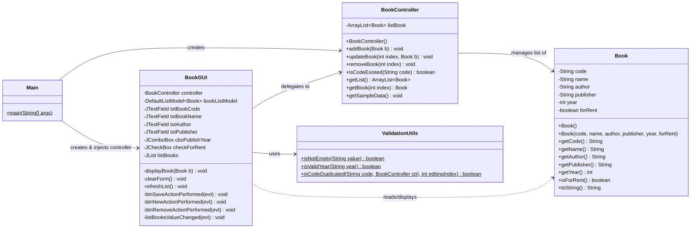
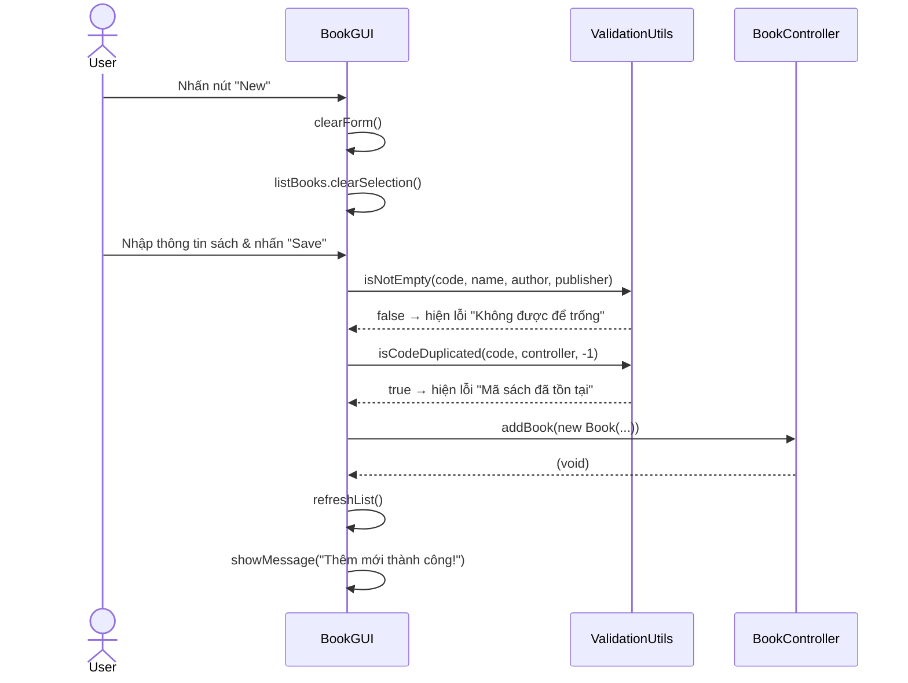
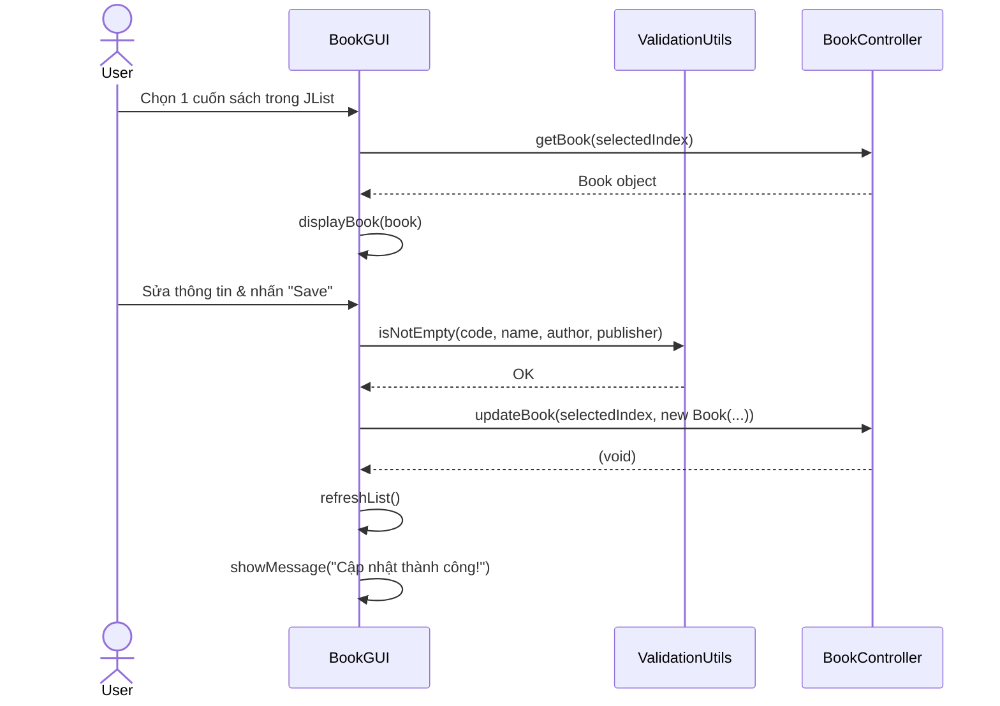
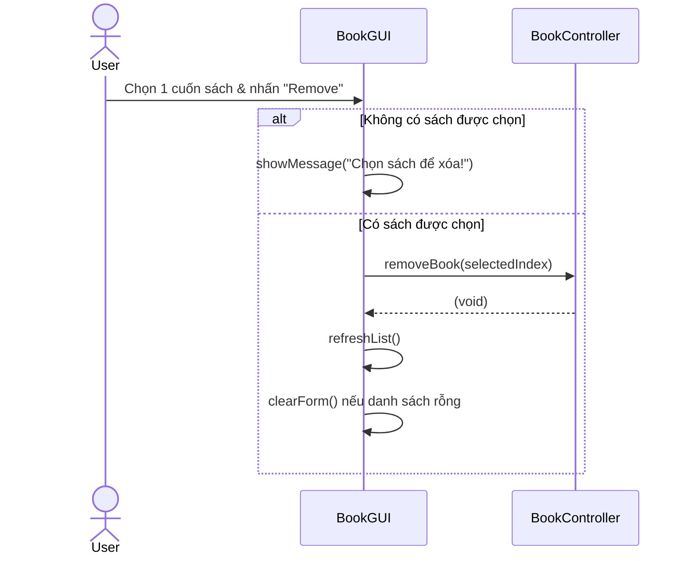

# Kế Hoạch Tái Cấu Trúc MVC — Dự án "Manage Book" (Java Swing)

> **Phạm vi:** Chỉnh lý MVC đơn giản, không dùng Observer/Repository/Event system.  
> **Mục tiêu:** Dễ giải thích, đúng chuẩn SWD392, phù hợp trình bày tài liệu.

---

## 1. Cấu trúc Package Trước & Sau

### ❌ Hiện tại (Sai chuẩn)

```
src/com/bach/
├── model/
│   └── Book.java               ← POJO + toString() bị nhiễm UI
├── controller/
│   └── BookController.java     ← Chứa ArrayList (vai trò Model) + import Swing UI
├── view/
│   └── BookGUI.java            ← Chứa validation + data seeding + flow control
├── utils/
│   └── ValidationUtils.java    ← Rỗng, không dùng
└── main/
    └── Main.java               ← Rỗng, hệ thống khởi chạy từ BookGUI.main()
```

### ✅ Sau khi tái cấu trúc (Đúng chuẩn)

```
src/com/bach/
├── model/
│   └── Book.java               ← POJO thuần, toString() hiển thị đầy đủ thông tin
├── controller/
│   └── BookController.java     ← Chứa ArrayList + xử lý nghiệp vụ, KHÔNG import Swing
├── view/
│   └── BookGUI.java            ← Chỉ hiển thị & thu nhận input, gọi Controller
├── utils/
│   └── ValidationUtils.java    ← Chứa các static method validate
└── main/
    └── Main.java               ← Điểm khởi tạo & kết nối MVC
```

> **Lưu ý:** Không thêm class mới. Chỉ phân phối lại trách nhiệm trong các file đã có.

---

## 2. UML Class Diagram



---

## 3. Sequence Diagrams

### A. Luồng: Thêm sách mới (Add Book)



### B. Luồng: Cập nhật sách (Update Book)



### C. Luồng: Xóa sách (Remove Book)



---

## 4. Chi Tiết Thay Đổi Theo Từng Class

### 4.1 `Book.java` — Thay đổi nhỏ (Giữ nguyên cấu trúc POJO)

| | Trước | Sau |
|---|---|---|
| `toString()` | `return name;` — Trả về name để hiển thị JList (UI Leakage) | `return "[" + code + "] " + name;` — Trả về thông tin đầy đủ, phù hợp debug/log |

> **Lý do:** JList sẽ dùng `toString()` để render text. Thay vì trả về chỉ `name`, ta trả về format rõ ràng hơn để phục vụ cả log và hiển thị.

---

### 4.2 `BookController.java` — Thay đổi trung bình

| | Trước | Sau |
|---|---|---|
| `import javax.swing.DefaultListModel` | CÓ — Coupled với Swing | **XÓA** — Controller không biết Swing |
| `loadDataToModel(DefaultListModel)` | CÓ — Thao tác UI từ Controller | **XÓA** — View tự đồng bộ JList |
| `ArrayList<Book> listBook` | Không khởi tạo → NullPointerException | **SỬA:** `= new ArrayList<>()` |
| `getBook(int index)` | Không có | **THÊM** — Trả về `listBook.get(index)` để View đọc khi user chọn |
| `getSampleData()` | Không có | **THÊM** — Chứa dữ liệu mẫu, không để trong View |

**Kết quả:** Controller chỉ import `com.bach.model.Book` và `java.util.ArrayList`. Không có bất kỳ import Swing nào.

---

### 4.3 `ValidationUtils.java` — Thêm 3 static method

```java
// Kiểm tra các trường không rỗng
public static boolean isNotEmpty(String... values)

// Kiểm tra năm hợp lệ (parse được sang int)
public static boolean isValidYear(String yearStr)

// Kiểm tra mã sách trùng lặp (editingIndex = -1 khi thêm mới, >= 0 khi sửa)
public static boolean isCodeDuplicated(String code, BookController ctrl, int editingIndex)
```

---

### 4.4 `BookGUI.java` — Thay đổi nhiều nhất

| | Trước | Sau |
|---|---|---|
| Dữ liệu mẫu trong constructor | `bookListModel.addElement(new Book(...))` trong `BookGUI()` | Gọi `controller.getSampleData()` → `refreshList()` |
| `bookListModel` + `control` khởi tạo inline | Field-level, controller rỗng | Controller được **tiêm qua constructor** từ `Main` |
| `btnSaveActionPerformed` — 10 trách nhiệm | 1 method dài ~40 dòng | Tách thành: `validateInput()` + `performSave()` |
| Logic phân loại Add/Update | Nằm trong Save listener | Vẫn nằm ở View — nhưng tách thành method riêng `isEditMode()` |
| `refreshList()` | Gọi `control.loadDataToModel(bookListModel)` | Gọi trực tiếp: xóa model, duyệt `controller.getList()` để add |
| `displayBook(Book b)` | Inline trong `listBooksValueChanged` | Tách thành private method riêng |
| `clearForm()` | Inline trong `btnNewActionPerformed` | Tách thành private method riêng |
| `main(String[] args)` | Trong `BookGUI` | **Di chuyển sang `Main.java`** |

---

### 4.5 `Main.java` — Trở thành Bootstrap Layer

```java
public class Main {
    public static void main(String[] args) {
        // 1. Khởi tạo Controller (chứa Model/data)
        BookController controller = new BookController();

        // 2. Nạp dữ liệu mẫu
        controller.getSampleData();

        // 3. Khởi tạo View và tiêm Controller vào
        java.awt.EventQueue.invokeLater(() -> {
            BookGUI gui = new BookGUI(controller);
            gui.setVisible(true);
        });
    }
}
```

---

## 5. Checklist Thực Thi (Theo thứ tự ưu tiên)

- [ ] **Bước 1 — Fix Critical Bug:** `BookController()` → thêm `listBook = new ArrayList<>()`
- [ ] **Bước 2 — Dọn Controller:** Xóa `import javax.swing.DefaultListModel`, xóa `loadDataToModel()`, thêm `getBook(int)`, thêm `getSampleData()`
- [ ] **Bước 3 — Viết ValidationUtils:** Thêm 3 static method validate
- [ ] **Bước 4 — Refactor BookGUI:** Tách method, inject Controller qua constructor, di chuyển data seeding ra ngoài
- [ ] **Bước 5 — Thiết lập Main:** Di chuyển `main()` và logic khởi tạo sang `Main.java`
- [ ] **Bước 6 — Fix toString() của Book:** Cập nhật format trả về

---

## 6. Phân tách Trách Nhiệm Cuối Cùng (Responsibility Matrix)

| Trách nhiệm | `Book` | `BookController` | `ValidationUtils` | `BookGUI` | `Main` |
|---|:---:|:---:|:---:|:---:|:---:|
| Lưu thuộc tính sách | ✅ | | | | |
| Lưu danh sách sách (ArrayList) | | ✅ | | | |
| Thêm / Sửa / Xóa sách | | ✅ | | | |
| Kiểm tra trùng mã sách | | ✅ | ✅ (gọi) | | |
| Kiểm tra trường không rỗng | | | ✅ | | |
| Hiển thị dữ liệu lên form | | | | ✅ | |
| Thu nhận input từ người dùng | | | | ✅ | |
| Đồng bộ JList sau thay đổi | | | | ✅ | |
| Khởi tạo dữ liệu mẫu | | ✅ | | | |
| Khởi tạo & kết nối M-V-C | | | | | ✅ |
