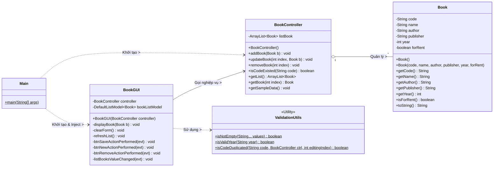
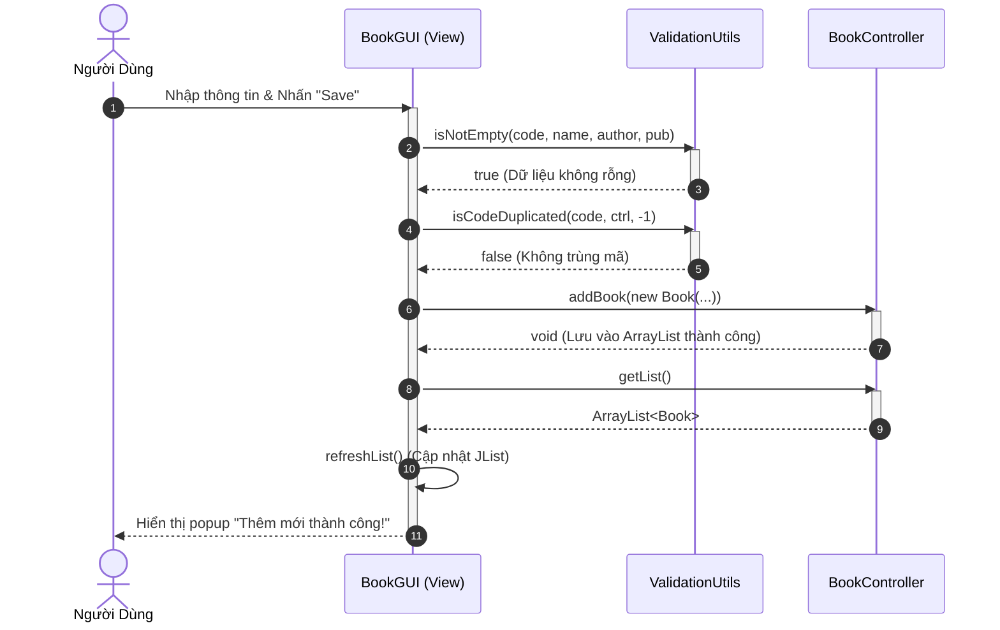

# Hướng Dẫn Vẽ UML và Làm Tài Liệu Báo Cáo (SRS & SDD)

Dưới đây là các sơ đồ UML nháp được viết bằng cú pháp Mermaid. 
👉 **Cách xem ảnh:** Bạn hãy copy toàn bộ khối chữ nằm trong các dải ````mermaid ... ```` và dán vào trang [mermaid.live](https://mermaid.live) để xem hình ảnh nhé. Bạn dùng hình này làm bản nháp để đối chiếu khi vẽ lại trên Visual Paradigm.

---

## 1. Sơ Đồ Use Case (Use Case Diagram)
*Dán vào phần Đặc tả yêu cầu của tài liệu SRS.*

```mermaid
usecaseDiagram
actor "Thủ thư / Người dùng" as User

rectangle "Hệ thống Manage Book" {
    usecase "Thêm sách mới" as UC1
    usecase "Cập nhật sách" as UC2
    usecase "Xóa sách" as UC3
    usecase "Xem danh sách sách" as UC4
    usecase "Kiểm tra tính hợp lệ (Validate)" as UC5
}

User --> UC1
User --> UC2
User --> UC3
User --> UC4

UC1 ..> UC5 : <<include>>
UC2 ..> UC5 : <<include>>
```

---

## 2. Sơ Đồ Lớp (Class Diagram)
*Dán vào phần Thiết kế cấu trúc tĩnh của tài liệu SDD.*



---

## 3. Sơ Đồ Tuần Tự (Sequence Diagram) - Luồng Thêm Sách
*Dán vào phần Thiết kế hành vi động của tài liệu SDD.*



---

## 📚 Dàn Ý Copy-Paste Cho Tài Liệu Báo Cáo Của Bạn

### PHẦN 1: SRS (Software Requirements Specification)

**1.1. Mục đích dự án:**
Phần mềm **Manage Book** là ứng dụng Desktop (Java Swing) giúp thủ thư quản lý thông tin các đầu sách trong thư viện (Mã, tên, tác giả, nhà xuất bản, năm, tình trạng cho thuê).

**1.2. Yêu cầu chức năng (Functional):**
*   **Quản lý danh sách:** Xem toàn bộ danh sách sách ở khung bên trái. Bấm vào sách sẽ hiển thị chi tiết sang form bên phải.
*   **Thêm sách mới:** Khởi tạo form trống, nhập liệu, kiểm tra ràng buộc (không rỗng, đúng định dạng năm, không trùng mã sách) và lưu vào hệ thống.
*   **Cập nhật sách:** Chỉnh sửa thông tin sách đang chọn và lưu lại. Tự động bỏ qua lỗi trùng mã nếu mã không thay đổi.
*   **Xóa sách:** Xóa sách đang được chọn trên lưới.

**1.3. Yêu cầu phi chức năng (Non-Functional):**
*   Kiến trúc: **MVC (Model - View - Controller)**.
*   Công nghệ: Java Core, Swing UI. Không sử dụng Framework/Database ngoài. Dữ liệu được quản lý in-memory bằng `ArrayList`.

---

### PHẦN 2: SDD (Software Design Document)

**2.1. Kiến trúc hệ thống (Architecture Design):**
*   Hệ thống phân tách nghiêm ngặt thành 3 tầng: 
    *   **Model (`Book`):** POJO chứa cấu trúc dữ liệu thuần.
    *   **View (`BookGUI`):** Giao diện Swing, chỉ nhận sự kiện và gọi Controller. KHÔNG chứa logic nghiệp vụ.
    *   **Controller (`BookController`):** Nhận dữ liệu từ View, thực thi nghiệp vụ (lưu trữ, sửa, xóa) trên tập hợp Model (`ArrayList`). Hoàn toàn không phụ thuộc vào thư viện giao diện (`javax.swing`).
*   **Bootstrap (`Main`):** Điểm khởi chạy duy nhất, tiêm (inject) Controller vào View để giảm coupling.
*   **Utility (`ValidationUtils`):** Tập trung toàn bộ logic kiểm tra tính hợp lệ dữ liệu.

**2.2. Sơ đồ thiết kế (UML Diagrams):**
*(Tại phần này, bạn xuất file ảnh từ Visual Paradigm và dán vào tài liệu Word, viết vài dòng giải thích bên dưới mỗi ảnh)*.
